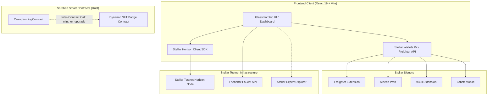
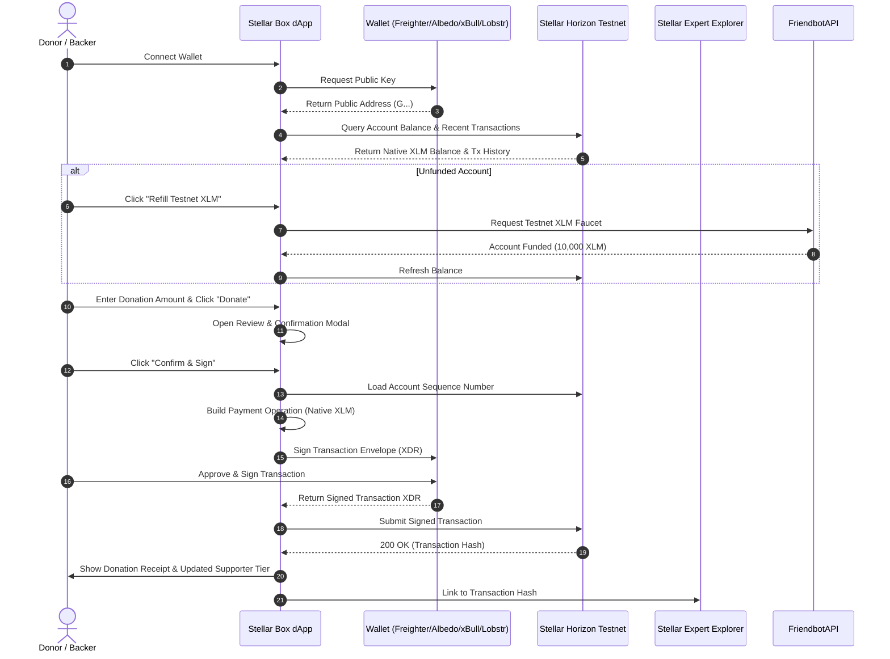

# 🌌 Stellar Box — Next-Gen Decentralized Crowdfunding & DAO Governance

[-yellow.svg?style=flat&logo=stellar)](https://stellar.org)
[](https://github.com/Rajesh-D-kasar/stellar-box/actions/workflows/ci.yml)
[](https://stellar.org)
[](https://soroban.stellar.org)
[](https://react.dev)
[](https://vitejs.dev)
[](LICENSE)

> **Stellar Box** is a decentralized crowdfunding and donation dApp built for the **Stellar Level 1 Frontend Challenge (Yellow Belt)** on **Stellar Testnet**. It enables users to connect multiple Stellar wallets, fund test accounts via Friendbot, sign and submit real on-chain Testnet XLM payments, inspect transaction history, and explore advanced DAO milestone concepts.

---

## 📑 Table of Contents

- [Overview](#-overview)
- [Key Features](#-key-features)
- [Architecture & Tech Stack](#-architecture--tech-stack)
- [System Data Flow](#-system-data-flow)
- [On-Chain vs. Interactive Demo Scope](#-on-chain-vs-interactive-demo-scope)
- [Soroban Smart Contract Specification](#-soroban-smart-contract-specification)
  - [Storage Model](#storage-model)
  - [Methods & Interface](#methods--interface)
  - [Dynamic NFT Donor Tiers](#dynamic-nft-donor-tiers)
  - [Contract Event Topics](#contract-event-topics)
- [Project Directory Structure](#-project-directory-structure)
- [Getting Started](#-getting-started)
  - [Prerequisites](#prerequisites)
  - [Installation & Local Setup](#installation--local-setup)
  - [Wallet Setup & Testnet Funding](#wallet-setup--testnet-funding)
- [Verification & Testing](#-verification--testing)
  - [Frontend Quality Checks](#frontend-quality-checks)
  - [Contract Unit Tests](#contract-unit-tests)
- [CI/CD Pipeline](#-cicd-pipeline)
- [Security & Best Practices](#-security--best-practices)
- [Roadmap](#-roadmap)
- [References & Acknowledgements](#-references--acknowledgements)
- [License](#-license)

---

## 🌟 Overview

Traditional crowdfunding platforms suffer from opaque fund management, static donor perks, and high intermediary fees. **Stellar Box** reimagines community-backed funding on the Stellar network by integrating:

1. **Direct Non-Custodial Contributions**: Direct XLM payments signed by users with instant on-chain finality on Stellar Testnet.
2. **DAO Milestone Governance**: Payout escrow mechanics governed by donor voting weight proportional to their financial contribution.
3. **Gamified Dynamic NFT Badges**: Smart contract tier progression (Bronze, Silver, Gold) that evolves based on cumulative donation volume.
4. **Universal Wallet Interoperability**: Instant connection across modern Stellar wallet providers via Stellar Wallets Kit and Freighter API.
5. **AI Campaign Assistant**: Local intelligence layer for drafting proposals, clarifying DAO mechanics, and guiding new contributors.

> [!IMPORTANT]
> **Testnet Only:** This repository is configured exclusively for the **Stellar Testnet**. Never use a wallet containing real mainnet assets or submit private keys/seed phrases.

---

## 🚀 Key Features

### 👛 1. Multi-Wallet Web3 Authentication
- Seamless support for **Freighter**, **Albedo**, **xBull**, and **Lobstr** signers.
- Persistent session storage in `localStorage` with graceful reconnect and disconnect flows.
- Real-time Horizon account validation and testnet balance queries.

### 💸 2. Direct On-Chain Payments & Faucet Integration
- Built-in **Friendbot Faucet** integration to fund or top up unfunded Testnet accounts with a single click.
- Amount preset selectors (`10`, `25`, `50`, `100`, `200` XLM) plus custom input with balance validation.
- Secure pre-flight confirmation modal and direct transaction hash explorer links to [Stellar Expert Testnet](https://stellar.expert/explorer/testnet).
- Live transaction history view displaying the last 5 account transactions fetched directly from Horizon.

### 🏛️ 3. DAO Milestone Escrow & Governance
- Milestones proposed by verified campaign creators with target release amounts.
- Donors cast weighted **YES / NO** votes based on cumulative XLM contributions.
- Majority approval triggers milestone fund release.

### 🏅 4. Dynamic NFT Supporter Badges
- Dynamic badge levels that calculate and upgrade based on lifetime contributions:
  - 🥉 **Bronze Tier**: `< 50 XLM`
  - 🥈 **Silver Tier**: `50 — 199.99 XLM`
  - 🥇 **Gold Tier**: `200+ XLM`
- Visual progression trackers and receipt summaries upon payment confirmation.

### 🤖 5. Gemini AI Campaign Assistant
- Interactive helper for drafting grant descriptions, summarizing milestone deliverables, and explaining Soroban contract mechanics.
- Quick prompt chips for fast access to campaign copy recommendations.

### 📡 6. Real-Time Event Stream
- Live session feed capturing campaign activity including donations, NFT evolutions, creator verifications, and DAO votes.

---

## 🏗️ Architecture & Tech Stack



### Technology Breakdown

| Domain | Technology | Version | Purpose |
| :--- | :--- | :--- | :--- |
| **Frontend Framework** | React | `^19.2.8` | Declarative reactive UI components |
| **Build Tool** | Vite | `^8.2.0` | Ultra-fast HMR and production bundling |
| **Stellar SDK** | `@stellar/stellar-sdk` | `^16.2.0` | Transaction construction, Horizon queries, and asset handling |
| **Wallet Connector** | `@creit.tech/stellar-wallets-kit` | `^2.5.0` | Multi-wallet abstraction (Freighter, Albedo, xBull, Lobstr) |
| **Freighter API** | `@stellar/freighter-api` | `^6.0.1` | Direct browser extension detection and signing |
| **Smart Contract** | Soroban SDK | `27.0.4` | `no_std` Rust smart contract environment |
| **Language & Toolchain** | Rust (Edition 2021) | Stable | High-assurance contract compilation & unit tests |
| **CI / CD** | GitHub Actions | `v4` | Automated linting, frontend building, and Rust contract testing |

---

## 🔄 System Data Flow



---

## ⚖️ On-Chain vs. Interactive Demo Scope

To maintain complete architectural transparency, here is the exact breakdown of live on-chain operations versus browser prototype features:

| Feature Area | Live On-Chain (Stellar Testnet) | Prototype / In-Browser Demo |
| :--- | :---: | :---: |
| **Wallet Authentication (Freighter, Albedo, xBull, Lobstr)** | ✅ Yes | — |
| **Account Balance Query (Horizon)** | ✅ Yes | — |
| **Friendbot Faucet Funding** | ✅ Yes | — |
| **Soroban Contract RPC Invocation (donate)** | ✅ Yes | — |
| **Transaction History Fetching & Explorer Links** | ✅ Yes | — |
| **DAO Milestone Voting & Fund Release** | Tested in Rust Test Suite | Local state in UI |
| **Dynamic NFT Badge Evolution** | Tested in Rust Test Suite | Local UI tier computation |
| **AI Campaign Assistant** | — | Local contextual engine |

---

## 📜 Soroban Smart Contract Specification

The smart contract is located in [`contract/src/lib.rs`](file:///c:/Users/ASUS/stellar-box/contract/src/lib.rs) and implements complete campaign lifecycle management, creator verification, weighted voting, and dynamic tier calculation.

### Storage Model

- **Instance Storage**:
  - `TARGET`: Campaign fundraising goal in stroops (`i128`).
  - `TOTAL`: Cumulative funds collected (`i128`).
  - `NFT_CTR`: Address of external Dynamic NFT badge contract (`Address`).
  - `CREATOR`: Address of the campaign creator (`Address`).
  - `ADMIN`: Platform administrator address for verification governance (`Address`).
  - `MS_COUNT`: Counter for proposed milestones (`u32`).
  - `INIT`: Initialization guard boolean (`bool`).
- **Persistent Storage**:
  - `DataKey::DonorWeight(Address)`: Maps donor address to lifetime contributed stroops (`i128`).
  - `DataKey::Milestone(u32)`: Stores `Milestone` struct (`id`, `description`, `amount`, `votes_for`, `votes_against`, `released`).
  - `DataKey::HasVoted(Address, u32)`: Anti-double-voting registry.
  - `DataKey::VerifiedCreator(Address)`: Creator verification status.

### Methods & Interface

```rust
pub fn init(env: Env, target_amount: i128, nft_badge_contract: Address, creator: Address, admin: Address);
pub fn verify_creator(env: Env, admin: Address, creator: Address);
pub fn donate(env: Env, donor: Address, amount: i128) -> u32;
pub fn add_milestone(env: Env, description: String, amount: i128) -> u32;
pub fn vote_milestone(env: Env, donor: Address, milestone_id: u32, approve: bool);
pub fn release_milestone(env: Env, milestone_id: u32) -> bool;
pub fn get_total(env: Env) -> i128;
pub fn get_target(env: Env) -> i128;
pub fn get_donor_weight(env: Env, donor: Address) -> i128;
pub fn get_donor_tier(env: Env, donor: Address) -> u32;
pub fn is_creator_verified(env: Env, creator: Address) -> bool;
pub fn get_milestone(env: Env, id: u32) -> Milestone;
```

### Dynamic NFT Donor Tiers

The contract automatically assigns donor badge tiers based on cumulative contribution (calculated in stroops, where `1 XLM = 10,000,000 stroops`):

| Tier Level | Name | Minimum Cumulative Contribution | Inter-Contract Action |
| :---: | :---: | :---: | :--- |
| **Tier 1** | Bronze 🥉 | `< 50 XLM` (`< 500,000,000 stroops`) | Triggers `mint_or_upgrade(donor, 1)` |
| **Tier 2** | Silver 🥈 | `50 — 199.99 XLM` (`500,000,000 — 1,999,999,999 stroops`) | Triggers `mint_or_upgrade(donor, 2)` |
| **Tier 3** | Gold 🥇 | `200+ XLM` (`≥ 2,000,000,000 stroops`) | Triggers `mint_or_upgrade(donor, 3)` |

### Contract Event Topics

The contract emits structured events for downstream indexers and notification services:

- `("donate", donor)`: Logs donation amount.
- `("nft_upg", donor)`: Logs newly unlocked dynamic NFT tier.
- `("verified", creator)`: Logs admin creator approval.
- `("ms_vote", donor)`: Logs milestone vote `(milestone_id, approve, weight)`.
- `("ms_rel", creator)`: Logs milestone fund release `(milestone_id, amount)`.

---

## 📁 Project Directory Structure

```text
stellar-box/
├── .github/
│   └── workflows/
│       └── ci.yml               # GitHub Actions CI/CD pipeline (Rust + Node)
├── contract/                    # Soroban Smart Contract
│   ├── Cargo.toml               # Rust package & dependency definitions (Soroban SDK v27)
│   └── src/
│       ├── lib.rs               # Core Crowdfunding contract implementation
│       └── test.rs              # Contract unit test suite (voting, tiers, admin)
├── public/                      # Static web assets
├── src/                         # Frontend Application (React 19 + Vite)
│   ├── App.jsx                  # Main application component & wallet/payment state
│   ├── App.css                  # Component stylesheets & responsive glassmorphism
│   ├── index.css                # Global design system & typography tokens
│   └── main.jsx                 # React root entrypoint
├── .editorconfig                # Workspace editor configuration
├── .gitignore                   # Git ignore policies
├── .nvmrc                       # Target Node.js runtime version (v20)
├── DEVELOPMENT.md               # Developer guidelines & contribution checklist
├── eslint.config.js             # ESLint configuration
├── index.html                   # Single Page Application HTML shell
├── package.json                 # Node package configuration & scripts
├── SECURITY.md                  # Security policies and reporting standards
└── vite.config.js               # Vite build configuration
```

---

## 🛠️ Getting Started

### Prerequisites

Ensure the following dependencies are installed on your workstation:

- **Node.js**: `v20.x` or later ([Download](https://nodejs.org/))
- **npm**: `v10.x` or later (bundled with Node.js)
- **Rust & Cargo**: (Optional, required for Soroban contract testing) `v1.80+` ([Install Rust](https://rustup.rs/))
- **Stellar Wallet**: Any supported Testnet wallet extension:
  - [Freighter Wallet](https://www.freighter.app/) *(Recommended)*
  - [Albedo Web Signer](https://albedo.link/)
  - [xBull Wallet](https://xbull.app/)
  - [Lobstr Wallet](https://lobstr.co/)

### Installation & Local Setup

1. **Clone the repository:**
   ```bash
   git clone https://github.com/Rajesh-D-kasar/stellar-box.git
   cd stellar-box
   ```

2. **Install dependencies:**
   ```bash
   npm ci
   ```

3. **Start the local development server:**
   ```bash
   npm run dev
   ```

4. **Access the application:**
   Open the local server URL (typically `http://localhost:5173`) in your browser.

### Wallet Setup & Testnet Funding

1. Open your **Freighter** (or other supported) wallet extension.
2. In the wallet settings, switch the active network from **Public (Mainnet)** to **Testnet**.
3. In Stellar Box, click **Select Wallet to Connect** and choose your wallet.
4. If your testnet wallet balance is `0.00 XLM`, click the **💧 Faucet** button to request test XLM from Friendbot automatically.

---

## 🧪 Verification & Testing

### Frontend Quality Checks & Tests

Run the automated ESLint rules, production Vite build, and Vitest test suite:

```bash
# Execute lint checks and production build bundle
npm run check

# Or execute individually:
npm run lint
npm run build
npm run test
```

### Contract Unit Tests

Verify the Soroban contract logic (donor tier math, milestone governance, verification permissions):

```bash
cd contract
cargo test --verbose
```

#### Test Suite Breakdown:
- `test_dynamic_nft_tier_progression`: Validates multi-step contribution tier progression (Bronze -> Silver -> Gold).
- `test_creator_verification`: Validates admin authorization guards on creator verification.
- `test_dao_milestone_voting_and_release`: Validates weighted milestone voting, quorum calculation, and fund release logic.

---

## 🤖 CI/CD Pipeline

Every pull request and push to `main` / `master` triggers our GitHub Actions pipeline ([`.github/workflows/ci.yml`](file:///c:/Users/ASUS/stellar-box/.github/workflows/ci.yml)), which executes:

1. **Soroban Contract Pipeline**:
   - Sets up stable Rust toolchain.
   - Caches Cargo registry and build targets.
   - Runs `cargo test --verbose` inside `contract/`.
2. **Frontend Pipeline**:
   - Sets up Node.js 20 with npm caching.
   - Installs dependencies via `npm ci`.
   - Runs ESLint validation (`npm run lint`).
   - Validates production compilation (`npm run build`).
   - Executes Vitest test suite (`npm run test`).

---

## 🔒 Security & Best Practices

- **Non-Custodial Architecture**: Stellar Box never collects, stores, or transmits user private keys. All cryptographic signing occurs securely inside the user's selected wallet client.
- **Strict Environment Isolation**: All transaction builders target `SDKNetworks.TESTNET` (`Test SDF Network ; September 2015`) and connect to `https://horizon-testnet.stellar.org`.
- **Pre-Flight Payment Safeguards**: Client-side sanity checks prevent zero/negative payments, invalid inputs, and transactions that exceed the current balance.
- **Repository Hygiene**: Seed phrases, secret keys, and `.env` files are strictly excluded via [`.gitignore`](file:///c:/Users/ASUS/stellar-box/.gitignore). For vulnerability reporting, see [SECURITY.md](file:///c:/Users/ASUS/stellar-box/SECURITY.md).

---

## 🗺️ Roadmap

- [x] Multi-wallet authentication (Freighter, Albedo, xBull, Lobstr).
- [x] Live Stellar Horizon payment pipeline and transaction explorer integration.
- [x] Soroban Crowdfunding smart contract with dynamic NFT tier calculations and DAO voting.
- [x] Interactive analytics, session event streams, and AI campaign assistant.
- [x] Direct frontend-to-Soroban RPC contract invocation via `@stellar/stellar-sdk` Soroban Client.
- [x] On-chain Dynamic NFT Badge contract deployment on Stellar Testnet.
- [x] Decentralized IPFS metadata storage for rich media campaign descriptions.

---

## 📚 References & Acknowledgements

- [Stellar Developers Documentation](https://developers.stellar.org/)
- [Soroban Smart Contract Documentation](https://soroban.stellar.org/docs)
- [Stellar Wallets Kit Documentation](https://github.com/Creit-Tech/Stellar-Wallets-Kit)
- [Stellar Expert Block Explorer](https://stellar.expert/explorer/testnet)
- UI inspiration: [Stellar Frontend Challenge Starter](https://github.com/Halfgork/stellar-frontend-challenge)

---

## 📄 License

This project is open source and available under the **[MIT License](LICENSE)**.
